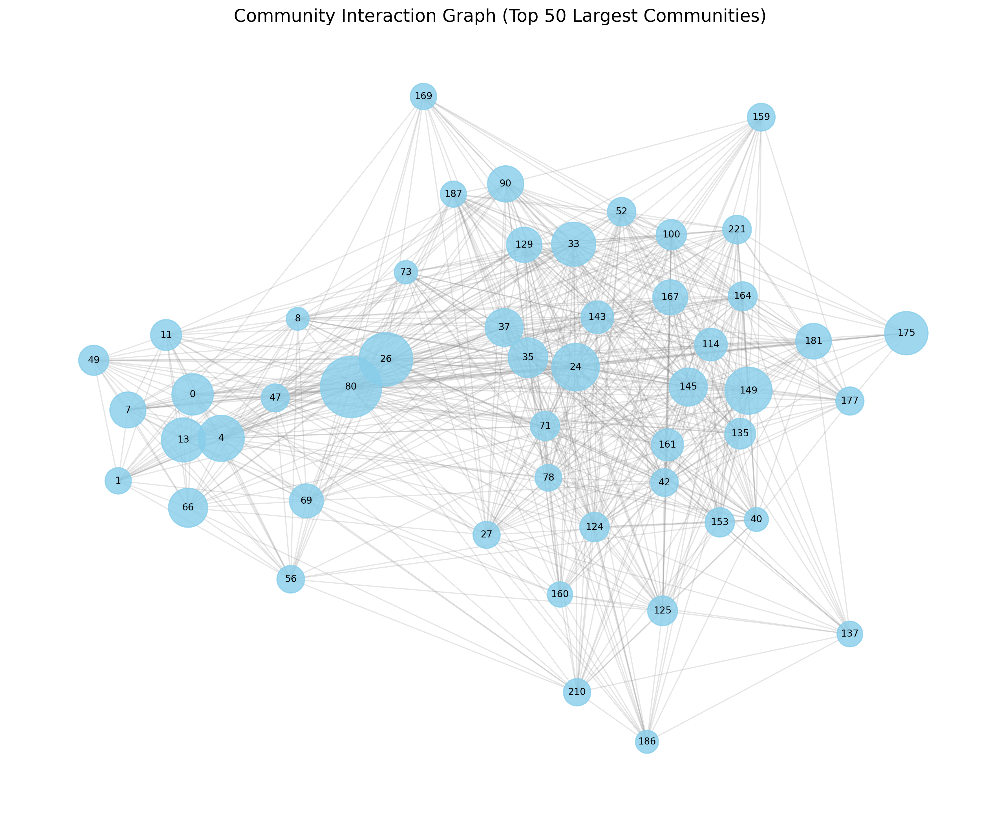
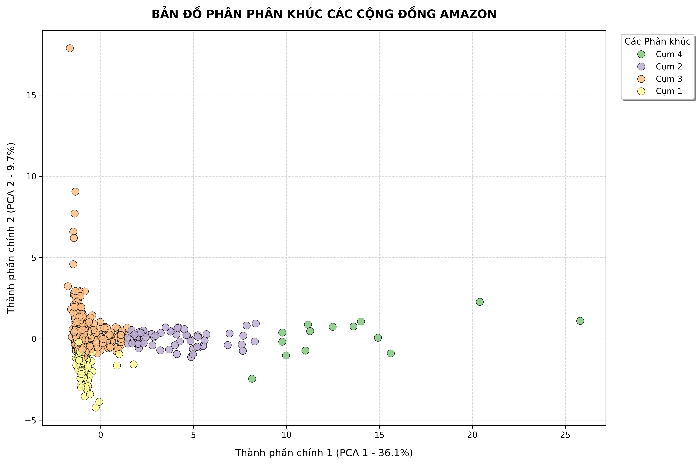

# Amazon Product Social Network Analysis

Dự án này ứng dụng Lý thuyết đồ thị (Graph Theory) và Phân tích mạng lưới xã hội (Social Network Analysis - SNA) để khám phá và phân tích mối quan hệ giữa các sản phẩm trên Amazon (ví dụ: các sản phẩm thường được mua cùng nhau). Từ đó, thực hiện gom cụm (Clustering) và phát hiện cộng đồng (Community Detection) để tìm ra các nhóm sản phẩm có độ liên kết cao.

## Quy trình phân tích
Dự án được chia thành các giai đoạn cụ thể:
1. **Overview & Descriptive Analysis:** Tổng quan và phân tích mô tả mạng lưới ban đầu.
2. **Preprocessing:** Làm sạch dữ liệu, xử lý các nhiễu trong đồ thị.
3. **Community Detection:** Chạy các thuật toán phát hiện cộng đồng trên đồ thị gốc và đồ thị đã qua xử lý.
4. **EDA & Community Analysis:** Phân tích sâu (EDA) vào các cộng đồng/cụm sản phẩm đã được phân chia.

## Cấu trúc dự án
```bash
├── app/                    
├── asset/                   
├── notebook/                   
│   ├── 1_overview.ipynb
│   ├── 2_descriptive_network_analysis.ipynb
│   ├── 3_preprocessing.ipynb
│   ├── 4_original_graph_community_detection.ipynb
│   ├── 5_preprocessed_graph_community_detection.ipynb
│   ├── 6_graph_information_eda.ipynb
│   └── 7_community_analysis.ipynb
├── requirements.txt          
├── setup.py                  
└── README.md
```
## Kết quả trực quan (Visualizations)

Dưới đây là toàn bộ các kết quả trực quan hóa thu được trong quá trình phân tích mạng lưới sản phẩm Amazon:

### 1. Phân tích Cộng đồng trên Đồ thị Gốc 
Mạng lưới cộng đồng ban đầu khi chưa qua xử lý lọc nhiễu, các sản phẩm liên kết với nhau thành các cụm lớn và dày đặc.


### 2. Phân tích Cộng đồng sau khi Xử lý dữ liệu 
Mạng lưới sau khi đã được làm sạch, loại bỏ bớt các kết nối nhiễu hoặc các nút đơn lẻ, giúp cấu trúc các cộng đồng sản phẩm lộ rõ và dễ phân tách hơn.


### 3. Mạng lưới tương tác giữa các Cộng đồng 
Biểu đồ thể hiện cách các cộng đồng sản phẩm lớn tương tác và có mối liên hệ mua kèm (co-purchasing) với nhau.


### 4. Kết quả Gom cụm bằng Thuật toán K-Means 
Trực quan hóa các phân khúc/nhóm sản phẩm được phân chia dựa trên các đặc trưng cấu trúc đồ thị thông qua thuật toán học không giám sát K-Means.



## 🛠️ Công nghệ & Thư viện
* **Ngôn ngữ:** Python
* **Phân tích dữ liệu:** Pandas, NumPy
* **Phân tích mạng lưới:** NetworkX (hoặc thư viện đồ thị bạn dùng)
* **Machine Learning / Clustering:** Scikit-learn (K-Means)
* **Trực quan hóa:** Matplotlib, Seaborn

| Thành viên | Nhiệm vụ |
| :--- | :--- |
| **Huỳnh Trần Bảo Việt** |  |
| **Lương Quốc Trung** | EDA, Visualize, Preprocess |
| **Trần Thành Đạt** |  |
| **Võ Nguyên Bảo** |  |
